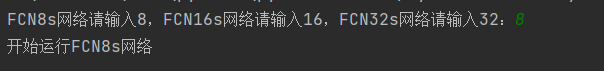
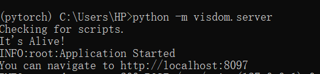
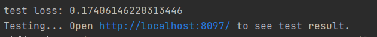
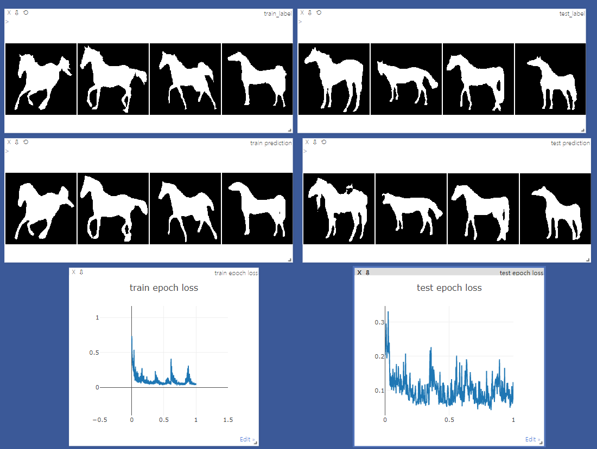

# HUST_fcn
视觉认知工程第三题fcn网络pytorch实现

<p align="center">
  
</p>


## 1.更新
- 17 August 2022: 上传仓库 

## 2.介绍
本项目对应华中科技大学人工智能与自动化学院视觉认知工程课程设计第三题设计

选择FCN网络，从零开始搭建了FCN32s，FCN16s，FCN8s三个网络，并在visdom上进行可视化，
在所给数据集上汇报了mIOU等指标

## 3.包含文件

### 3.1 [train.py](train.py)
* 数据的读取与预处理
* 模型训练与测试
* 主函数

### 3.2 [FCN32.py](FCN32.py)
* FCN32s模型搭建

### 3.3 [FCN16.py](FCN16.py)
* FCN16s模型搭建

### 3.4 [FCN8.py](FCN8.py)
* FCN8s模型搭建

### 3.5 [mIOU.py](mIOU.py)
* mIOU指标
    
## 4.准备数据
将数据放入weizmann_horse_db文件夹使其具有以下格式
````

├──── weizmann_horse_db
│    ├──── horse (327 images)
│    └──── mask (327 images)

数据获取方式：https://www.kaggle.com/datasets/ztaihong/weizmann-horse-database/metadata
````
    
## 5.运行指南
### 5.1运行环境
* 编程语言：Python：3.6
* 使用框架：pytorch
* 可视化工具选择：visdom

对应库版本：
* torch 1.2.0
* numpy 1.17.0
* torchvision 0.4.0 
* visdom 0.1.8.9

### 5.2程序运行
直接运行train.py文件进行训练与测试
然后对模型进行选择（输入对应选择参数）
<p align="center">
  
</p>

### 5.3可视化
需打开命令行并进入编译环境
输入如下代码 python -m visdom.server
获取远程主机连接，若连接成功，则会返回如下信息
<p align="center">
  
</p>

在运行≥1个epoch后，会出现visdom的可视化界面入口
<p align="center">
  
</p>

### 5.4运行结果
#### 5.4.1
pycharm 输出端，可查看训练集与测试集上的loss，mIOU等指标

#### 5.4.2
visdom 可视化界面，可查看loss 随epoch的变化曲线，以及预测结果与mask的比较
<p align="center">
  
</p>
